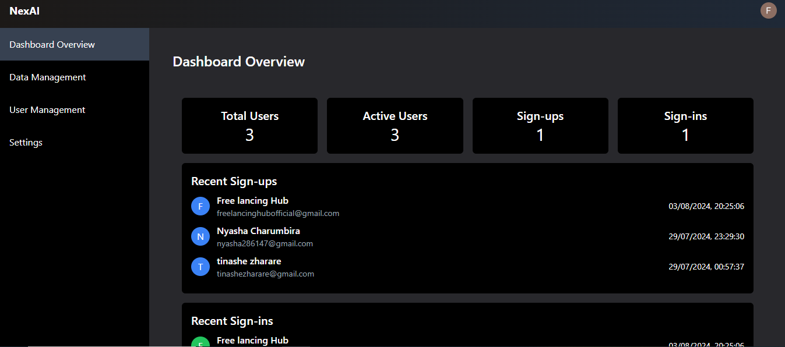
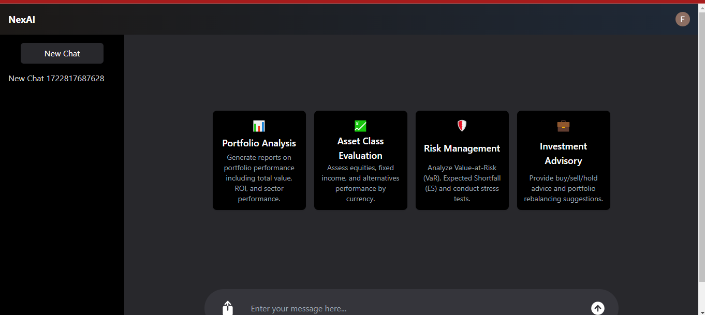

# Company Insights Chatbot

The Company Insights Chatbot is an advanced analytical tool designed to provide comprehensive insights into various aspects of company data. Leveraging the OpenAI Assistant API with a code interpreter, this chatbot delivers in-depth analyses and actionable recommendations tailored to user-specific needs.

## Key Features

- **Portfolio Analysis:** Generates detailed reports on portfolio performance, asset allocation, and sectoral/geographical contributions.

- **Asset Class Evaluation:** Assesses performance across various asset classes including equities and fixed income, with currency-based insights.

- **Risk Management:** Offers analyses on risk metrics such as VaR and ES, and includes stress testing and sensitivity analyses.
  
- **Investment Advisory:** Provides expert buy/sell/hold recommendations and strategies for portfolio rebalancing.

- **Transaction Oversight:** Tracks and lists all transaction details for meticulous financial management.

- **Holdings Management:** Reports on the specifics of holdings within a portfolio to inform investment decisions.

- **Tax Strategy:** Suggests methods to optimize tax liabilities and benefits.

- **Compliance Monitoring:** Ensures adherence to regulatory standards and identifies necessary corrective actions.

- **Client Reporting:** Creates tailored reports for clients, highlighting investment strategies and portfolio performance.

- **Market Insights:** Keeps users informed on market trends and economic indicators.


 


## Step 1: Clone the Repository

First, clone the repository using git:

```
git clone https://github.com/RaheesAhmed/Company-Insights-Chatbot.git
```

## Step 2: Navigate to the Project Directory

After cloning, change into the project directory:
```
cd Company-Insights-Chatbot
```

## Step 3: Install Dependencies

Install the necessary npm packages:
```
npm install
```

Create a new file in the root directory and name it as `.env` and following keys:
```
OPENAI_API_KEY=
OPENAI_ASSISTANT_ID=
NEXT_PUBLIC_CLERK_PUBLISHABLE_KEY=
CLERK_SECRET_KEY=

```

## Step 4: Start the Application
Start the server using npm:

```
npm run start
```

## Step 5: Access the Application
Open your web browser and go to the following URL to access the application:


```
http://localhost:3000
```


## Testing the Application
Once the application is running, you can test it by interacting with the interface provided at localhost:3000.